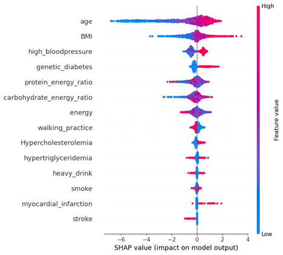

# Independent-Capstone-Design
개별연구(CSC 다양한 관점에서의 보건영양데이터 분석 및 결과 도출) - 2024년도 1학기 진행

# 연구 주제: 머신러닝 기반 당뇨병 분류 모델 구현 및 XAI 기법을 활용한 유발 인자 분석

2024년도 1학기에 진행한 개별연구이다. 연구 주제는 [머신러닝(XGBoost) 기반 당뇨병 분류 모델 구현](#1-머신러닝xgboost-기반-당뇨병-분류-모델-구현), [XAI 기법(SHAP)을 활용한 유발 인자 분석](#2-xai-기법shap을-활용한-유발-인자-분석)이다.

# 1. 머신러닝(XGBoost) 기반 당뇨병 분류 모델 구현
## **개요**
공중보건의 발전에 있어 데이터 과학과 인공지능 기술은 중대한 역할을 하고 있다. 본 연구는 국민건강영양조사의 원시자료를 활용하여 머신러닝 기법을 이용한 당뇨병 분류 모델을 구축하고, 이를 더욱 심층적으로 분석하기 위해 SHAP 기반의 설명 가능한 인공지능(XAI) 기법을 도입한다. 이 연구의 목적은 당뇨병을 유발하는 주요 인자들을 명확하게 식별하고 이를 통해 당뇨병의 조기 발견 및 관리에 기여하고자 하는 데에 있다.

## **선정 데이터 및 전처리**

- ## 선정 데이터: 국민건강영양조사 8기(2019-2021) 원시자료

본 연구에서 활용할 데이터는 질병관리본부에서 제공하는 국민건강영양조사 8기(2019-2021) 원시자료이다. 이 중, 2019 – 2021년도의 데이터인 8기 데이터를 활용하였다. 조사는 총 576조사구, 14,400가구를 대상으로 진행되었고, 총 976개의 변수와 22559개의 응답 데이터가 존재하는 것을 확인하였다.

- ## 데이터 전처리

    ### 1. 변수 선정
    국민건강영양조사 데이터셋의 976개의 변수를 대상으로 대한당뇨병학회에서 정의한 위험 인자 중에서 조절 불가 인자, 만성 질환 인자, 생활 습관 인자를 중심으로 리스트를 구성하였다.

    |||
    | :---: | :---: |
    |  |  | 
    | 대한당뇨병학회에서 정의한 위험 인자 리스트 | 모델 학습용으로 선정한 변수 리스트 |  

    ### 2. 결측치 처리
    결측치 처리는 Knn 알고리즘을 적용하여 결측치를 채우는 과정을 진행하였음.

    ### 3. 유효 데이터 생성

    #### 당뇨병 판정
    당뇨병 여부를 판단하는 로직은 다음과 같다.
    
    - 정상: 
        - DE1_31(인슐린 주사 치료 여부) != 1
        - DE1_32(당뇨병약 치료 여부) != 1
        - DE1_dg(당뇨병 의사진단 여부) != 1 
        - HE_glu(공복혈당) < 126 
        - HE_HbA1c(당화혈색소) < 6.5

    - 당뇨병: 그 외의 경우

    #### 음주 정도 판정
    남성과 여성의 폭음 여부를 판단하는 로직은 다음과 같다.

    - 남성 (sex = 1):
        - BD1_11(1년간 음주빈도) == 3, 4, 5, 6
        - BD2_1(한 번에 마시는 음주량) == 4, 5
    - 여성 (sex = 2):
        - BD1_11(1년간 음주빈도) == 3, 4, 5, 6
        - BD2_1(한 번에 마시는 음주량) == 3, 4, 5

    #### 걷기 실천도 판정
    걷기 실천도를 판단하는 로직은 다음과 같다.

    - BE3_31(걷기 일수) >= 5
    - BE3_32(걷기 지속 시간(시간)) >= 1 OR BE3_33(걷기 지속 시간(분)) >= 30

    #### 에너지 섭취 분율
    대한당뇨병학회에서 정의한 계산 공식을 이용하여 각 영양소 별 섭취분율을 계산함.

    $$\text{영양소 에너지 섭취분율} = \frac{\text{영양소 섭취량} \times (\text{영양소 1g당 kcal})}{(\text{단백질 섭취량} \times 4) + (\text{지방 섭취량} \times 9) + (\text{탄수화물 섭취량} \times 4)}$$

## **데이터 전처리 결과** 

| No. | 변수명                    | 전체 데이터 수 | 남성 데이터 수 | 여성 데이터 수 | 자료형    |
|-----|--------------------------|----------------|----------------|----------------|-----------|
| 1   | sex                      | 17272          | -              | -              | category  |
| 2   | age                      | 17272          | 7669           | 9603           | float     |
| 3   | heavy_drink              | 17272          | 7669           | 9603           | category  |
| 4   | smoke                    | 17272          | 7669           | 9603           | category  |
| 5   | genetic_diabetes         | 17272          | 7669           | 9603           | category  |
| 6   | Hypercholesterolemia     | 17272          | 7669           | 9603           | category  |
| 7   | hypertriglyceridemia     | 17272          | 7669           | 9603           | category  |
| 8   | high_bloodpressure       | 17272          | 7669           | 9603           | category  |
| 9   | stroke                   | 17272          | 7669           | 9603           | category  |
| 10  | myocardial_infarction    | -              | 7669           | 9603           | category  |
| 11  | BMI                      | 17272          | 7669           | 9603           | float     |
| 12  | walking_practice         | 17272          | 7669           | 9603           | category  |
| 13  | pregnancy_count          | -              | -              | 9603           | float     |
| 14  | protein_energy_ratio     | 17272          | 7669           | 9603           | float     |
| 15  | carbohydrate_energy_ratio| 17272          | 7669           | 9603           | float     |
| 16  | energy                   | 17272          | 7669           | 9603           | float     |
| 17  | diabetes                 | 17272          | 7669           | 9603           | category  |

## **데이터 전처리 코드**

- [전체 데이터 전처리](code/final_data_preprocessing.ipynb)
- [남성 데이터 전처리](code/final_data_preprocessing_man.ipynb)
- [여성 데이터 전처리](code/final_data_preprocessing_woman.ipynb)

## **모델 학습 및 평가**
모델 평가 기법은 k-fold 기법을 이용하였고 k=5로 설정하여 모델 평가를 진행함. 평가 지표는 AUC, 정확도, F1-score를 채택하였음. 아래 표는 각 데이터 셋 별 평균값이다.

|  | 전체 데이터셋 | 남성 데이터셋 | 여성 데이터셋 |
| :-------: | :-----: | :-----: | :-----: |
| **AUC** | 0.92 | 0.93 | 0.96 |
| **정확도** | 0.83 | 0.84 | 0.88 |
| **F1-score** | 0.83 | 0.84 | 0.88 |
| **ROC curve** |  |  |  |

# 2. XAI 기법(SHAP)을 활용한 유발 인자 분석

## **SHAP**
SHAP(SHapley Additive exPlanations)는 Shapley Value를 이용하여 예측에 영향을 미치는 변수들을 파악할 수 있는 기법으로, 머신러닝 모델에서의 Shapley Value는 예측 결과에 대한 각 변수의 기여도를 의미한다. Shapley Value는 변수간의 의존성을 확인할 수 있고 변수 중요도를 측정할 때 기존의 방법으로는 양의 영향력만 측정할 수 있었으나 SHAP를 적용하면 음의 영향력 또한 측정할 수 있다. 그리고 SHAP는 전체 데이터셋에 대한 해석뿐만 아니라 하나의 데이터에 대한 해석도 제공한다는 특징이 존재한다.

## **분석 결과**

### 1. 변수중요도

| 전체 데이터셋 | 남성 데이터셋 | 여성 데이터셋 |
| :-----: | :-----: | :-----: |
|  |  |  |

### 2. 모델 기반 SHAP 분석 beeswarm 그래프

| 전체 데이터셋 | 남성 데이터셋 | 여성 데이터셋 |
| :-----: | :-----: | :-----: |
|  |  |  |

## **모델 학습 및 SHAP 분석 코드**
- [전체 데이터 셋 기반 코드](code/final_model.ipynb)
- [남성 데이터 셋 기반 코드](code/final_model_man.ipynb)
- [여성 데이터 셋 기반 코드](code/final_model_woman.ipynb)